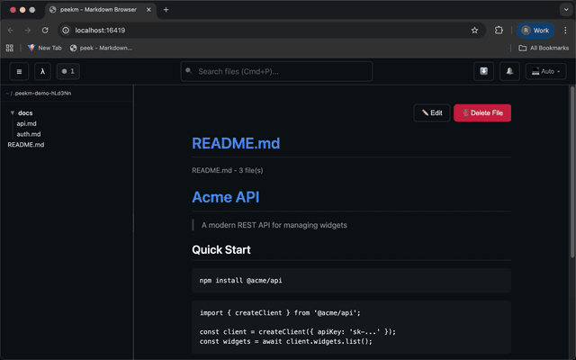

# peekm

[](https://goreportcard.com/report/github.com/razvandimescu/peekm)
[](https://github.com/razvandimescu/peekm/releases)
[](LICENSE)

> The markdown viewer built for AI-assisted development



Watch your AI write documentation live. See which session created every file. Get toast notifications the instant something changes — no hunting through file trees, no manual refresh, no breaking your flow.

```bash
peekm README.md    # Install, run, done.
```

Works beautifully for everyone else, too — zero-config live preview with GitHub styling, directory browsing, and dark/light themes.

**Perfect for:**

- 🤖 **AI coding workflows** — See which AI session created or modified each file, live as it happens
- 🤖 **Multi-session projects** — Track which AI conversation touched which files
- 📖 **Documentation, writing, PR reviews** — Centered layout, live reload, distraction-free

[Quick Start](#quick-start) • [AI Session Tracking](#ai-session-tracking) • [Comparison](#peekm-vs-the-world)

## Quick Start

```bash
# Install
brew install razvandimescu/tap/peekm

# Start viewing
peekm .
```

**That's it.** No config, no runtime dependencies.

**Optional: Connect to Claude Code** for AI session tracking:

```bash
peekm setup claude-code    # One-time setup
```

AI session badges now appear automatically when Claude Code creates or modifies files. [Learn more →](#ai-session-tracking)

## AI Session Tracking

peekm automatically tracks which AI session created or modified each file. This works out of the box — the tracking endpoint is always active.

**One-time setup** to connect your AI coding assistant:

```bash
peekm setup claude-code              # Configure Claude Code integration
peekm setup claude-code --port 8080  # Use custom port
peekm setup claude-code --remove     # Remove integration
```

The setup command:
- Creates the hook script (`~/.claude/peekm-hook.sh`)
- Merges PostToolUse hooks into Claude Code's `settings.json`
- Is idempotent — safe to run multiple times
- Is non-destructive — preserves your existing settings

**What you get:**
- Toast notifications when AI creates or modifies markdown files
- Session badges showing which AI session touched each file
- Info panel with session ID, operation type, permission mode, and timestamp
- Notification history (bell icon) with the last 10 file changes

## peekm vs. The World

| Feature | Glow | grip | VS Code | peekm |
|---------|------|------|---------|-------|
| **Best for** | Terminal purists | GitHub preview | VS Code users | AI-assisted development |
| **Live reload** | ❌ Static | ❌ Manual refresh | ✅ | ✅ SSE-based |
| **AI session tracking** | ❌ | ❌ | ❌ | ✅ Built-in |
| **Sidebar + zen mode** | ❌ | ❌ | ❌ Persistent only | ✅ Cmd/Ctrl+B toggle |
| **Comfortable layout** | ❌ Terminal only | ❌ Full-width | ❌ Splits editor | ✅ Centered 900px |
| **Directory browser** | ✅ TUI list | ❌ Single file | ❌ File explorer | ✅ Web UI tree |
| **Works offline** | ✅ | ❌ GitHub API | ✅ | ✅ |
| **Zero dependencies** | ✅ Single binary | ❌ Python runtime | ❌ Needs VS Code | ✅ Single binary |
| **Startup time** | Fast | ~2s | Editor launch | < 100ms |

## Features

### VS Code-Style Navigation

Navigate your documentation with a familiar sidebar. Need full-width focus? Hit `Cmd/Ctrl+B` to hide the sidebar.

- **280px tree view** — collapsible folders with indent-based hierarchy
- **Smart defaults** — auto-opens README.md or most recent file
- **Independent scrolling** — sidebar and content scroll separately
- **Current file highlighting** — see your location in the project
- **Multi-tab support** — Cmd/Ctrl+Click opens files in new tabs

### Zero Friction
- **Single binary** — download and run, nothing to install
- **No configuration** — works perfectly out of the box
- **Instant startup** — under 100ms to first render

### Live Workflow
- **Auto-reload on save** — see changes instantly via Server-Sent Events
- **Event replay** — reconnecting clients catch up on missed events
- **Directory navigation** — console-like λ button to navigate between directories
- **Theme switching** — Light/Dark/Auto with localStorage persistence
- **HTML export** — download self-contained HTML for sharing
- **Live editing** — edit markdown files directly in browser

### Production-Ready
- **Secure** — whitelist-based file access, CSRF protection, symlink validation, path traversal protection, $HOME boundary enforcement
- **Fast** — ~8MB memory footprint, embedded resources
- **Cross-platform** — works on macOS, Linux, and Windows
- **GitHub-Flavored Markdown** — full GFM support with syntax highlighting
- **Graceful shutdown** — clean resource cleanup on SIGINT/SIGTERM

## Installation

**Option 1: Quick Install**

```bash
# macOS/Linux
curl -L https://github.com/razvandimescu/peekm/releases/latest/download/peekm_$(uname -s)_$(uname -m).tar.gz | tar xz && sudo mv peekm /usr/local/bin/
```

**Option 2: Homebrew**

```bash
brew install razvandimescu/tap/peekm
```

**Option 3: Go Install**

```bash
go install github.com/razvandimescu/peekm@latest
```

**Option 4: Download Binary**

Download from the [releases page](https://github.com/razvandimescu/peekm/releases) for your platform (macOS, Linux, Windows).

## Usage

```bash
# View a specific file (opens in unified layout with sidebar)
peekm README.md

# Browse a directory
peekm .
peekm ../docs

# Custom port
peekm -port 8080 .

# Don't auto-open browser
peekm -browser=false .

# Setup AI session tracking
peekm setup claude-code
```

### Options

| Flag | Default | Description |
|------|---------|-------------|
| `-port` | `6419` | Port to serve on |
| `-browser` | `true` | Automatically open browser |
| `-version` | `false` | Show version information |
| `-show-ignored` | `false` | Show all excluded directories and exit |
| `-no-ai-tracking` | `false` | Disable AI session tracking endpoint |

### Subcommands

| Command | Description |
|---------|-------------|
| `setup claude-code` | Configure Claude Code integration (one-time) |
| `setup claude-code --remove` | Remove Claude Code integration |
| `setup claude-code --port PORT` | Configure with custom port |

## Ignoring Directories

peekm automatically excludes common directories:
- `.*` (hidden directories like `.git`, `.vscode` — except `.claude`)
- `node_modules`, `vendor`, `dist`, `venv`, `env`, `virtualenv`

To add custom exclusions, create `.peekmignore` in your project root:

```
# .peekmignore - Project-specific exclusions
target
_site
out
*.tmp
*.cache
```

**Syntax:** One pattern per line. Simple paths, wildcards (`*.tmp`, `test_*`), and comments (`#`).

```bash
peekm --show-ignored           # See all exclusions
peekm --show-ignored ~/myapp   # Check exclusions for a directory
```

## When You Need peekm

### AI-Assisted Development
```bash
peekm .
# Ask Claude Code: "Create API docs in docs/api.md"
# → Toast notification appears instantly
# → Click to view the new file
# → Watch live as AI writes
```

### Onboarding to a New Project
```bash
git clone github.com/awesome/project && cd project
peekm docs/    # Browse all documentation with a visual tree
```

### Writing Documentation
```bash
peekm README.md    # Edit in your favorite editor, preview updates instantly
```

### Code Review
```bash
git checkout feature-branch
peekm CHANGELOG.md    # Beautiful rendering, auto-reloads on branch switch
```

## How It Works

1. **Parse** — Converts markdown to HTML using [goldmark](https://github.com/yuin/goldmark)
2. **Serve** — Starts a local HTTP server with graceful shutdown
3. **Watch** — Monitors file changes using [fsnotify](https://github.com/fsnotify/fsnotify)
4. **Reload** — Sends live updates via Server-Sent Events (SSE) with event replay
5. **Track** — Receives AI session metadata and correlates with file changes
6. **Render** — Applies GitHub styling with embedded CSS (zero runtime dependencies)

## Development

### Requirements

- Go 1.21 or higher

### Building

```bash
go build -o peekm
go test -race ./...
```

### Project Structure

```
peekm/
├── main.go                    # Single-file Go implementation with embedded resources
└── theme/                     # Embedded resources (loaded at build time)
    ├── github-markdown.css    # Official GitHub markdown CSS
    ├── theme-overrides.css    # Theme switching CSS
    ├── theme-manager.js       # Shared theme management logic
    ├── navigation.js          # SPA navigation, notifications, search
    ├── editor.js              # Markdown editing functionality
    ├── file-browser.html      # Unified template (browser + file views)
    └── session-info-panel.html # AI session metadata panel
```

## Contributing

Contributions are welcome! Please feel free to submit a Pull Request.

## License

MIT License — see [LICENSE](LICENSE) file for details.

## Acknowledgments

- [goldmark](https://github.com/yuin/goldmark) — Markdown parser
- [fsnotify](https://github.com/fsnotify/fsnotify) — Cross-platform file watching
- [chroma](https://github.com/alecthomas/chroma) — Syntax highlighting

## Related Projects

- [glow](https://github.com/charmbracelet/glow) — Terminal markdown renderer (21k+ stars)
- [grip](https://github.com/joeyespo/grip) — GitHub-flavored markdown preview (6.7k stars)
- [VS Code Markdown Preview](https://code.visualstudio.com/docs/languages/markdown) — Built-in editor preview
