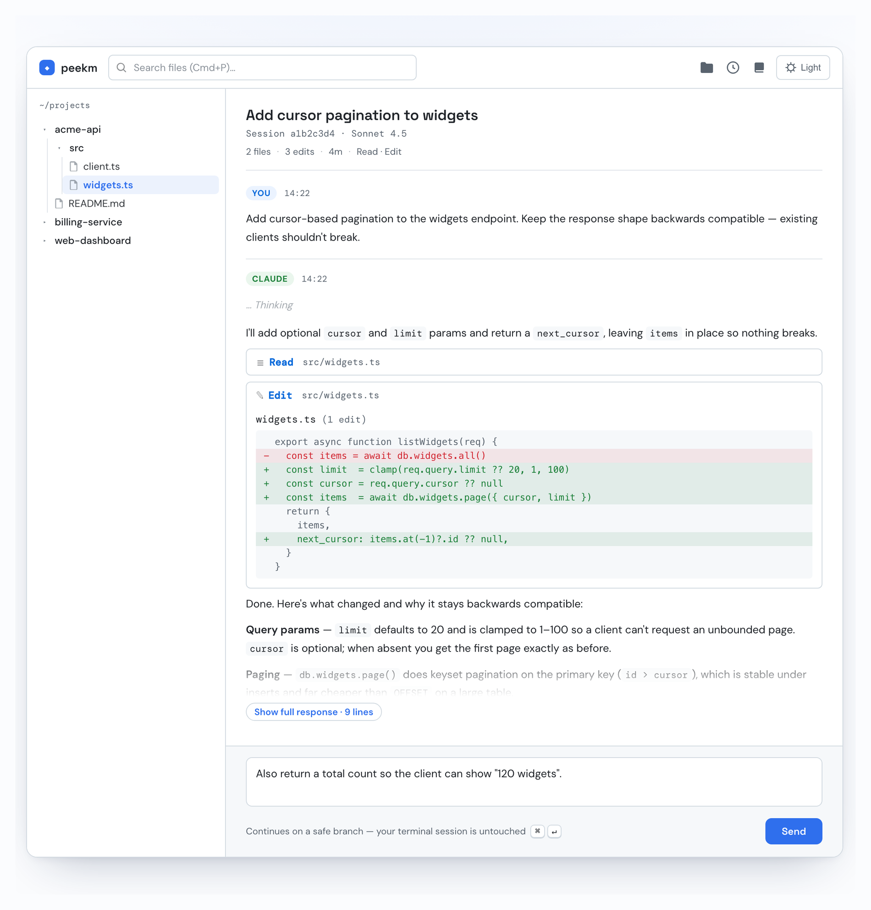

# peekm

**Read, review, and share what Claude Code actually did — across every project, live or long after.**

[](https://github.com/razvandimescu/peekm)
[](https://goreportcard.com/report/github.com/razvandimescu/peekm)
[](https://github.com/razvandimescu/peekm/releases)
[](LICENSE)

A local dashboard to read every Claude Code conversation, review the diffs and what the AI learned, and share the files it produced — across all your projects at once. **[peekm.dev](https://peekm.dev)**

[](https://peekm.dev/#demo)

> **[▶ Try the live demo →](https://peekm.dev/#demo)** — open a diff, expand a response, or reply to continue a session, right in the page.

> A Claude Code session leaves you a git diff and a JSONL log. peekm turns it into something you can read — the full conversation, line-level diffs, what the AI remembers about each project — and lets you reply to continue any session in an isolated fork.

**All data stays local. No accounts. No telemetry. Open source (Apache 2.0).**

## Getting Started

```bash
npx @peekm/peekm .
```

Requires [Claude Code](https://claude.ai/download) for AI tracking. Setup is automatic on first run.

Start a Claude Code session in any project. Watch the timeline update in real time.

Run `peekm setup autostart` to launch peekm automatically on login.

Or install globally: `npm i -g @peekm/peekm` | `brew install razvandimescu/tap/peekm`

## What You Get

**Read & review every session:**

- **Transcript viewer** — read the full AI conversation for any session. Tool calls, line-level code diffs, and thinking blocks rendered inline — refreshed live while the session is still running
- **Memory browser** — see what Claude remembers about each of your projects, side by side
- **Timeline** — every AI session across all projects, grouped by day, with live status showing which tool the AI is using right now. Duration, file counts, tool breakdown, All/Edits-only filter
- **Continue a session (read-only)** — reply to any transcript to ask a follow-up. peekm runs it as an isolated forked session with read-only tools, so it can inspect and answer but never edits files or touches the session running in your terminal
- **Real-time notifications** — toast the instant AI modifies a file, with live reload via SSE

**Share it:**

- **Sharing** — share any file the AI produced (Markdown, HTML, SVG, TXT) via LAN or a public URL through `share.peekm.dev` (opt-in, 1-hour TTL, no account). HTML shares include co-located assets (CSS, JS, images); Markdown shares offer one-click DOCX download

**Also included:**
- **File viewer** — VS Code-style sidebar with Markdown, HTML, SVG, and TXT support. Fuzzy search (Cmd/Ctrl+P), in-browser editing (Markdown), Mermaid diagram rendering, syntax highlighting, light/dark/auto themes
- **Smart folders** — "Recent AI Edits" surfaces files touched by AI in the last 24 hours
- **Persistent history** — events survive restarts via `~/.peekm/events.jsonl`

## How It Works

peekm registers a PostToolUse hook with Claude Code so it can correlate file edits with the session that made them. Setup runs automatically on first launch when `~/.claude` exists.

**What setup does:**

- Creates `~/.claude/peekm-hook.sh` — the hook script that fires after each Claude Code tool call.
- Adds an entry to `~/.claude/settings.json` under `hooks.PostToolUse` — non-destructive merge; existing hooks are preserved, and re-running setup is idempotent.
- Captures events to `~/.peekm/events.jsonl` — appended even when peekm isn't running, so no sessions are lost.

**What the hook sends:** session ID, file path, and tool name — no file contents, no prompts, no model output. Posted to `127.0.0.1:6419` only. Nothing leaves your machine except what you explicitly trigger: public sharing (opt-in), or continuing a session — which sends your reply and the files it reads to Anthropic's model API, exactly as any Claude Code session does.

**To remove:** `peekm setup claude-code --remove` strips the entry from `settings.json` and deletes the hook script.

## Installation

**npm** (recommended)
```bash
npm i -g @peekm/peekm
```

Try without installing: `npx @peekm/peekm .` | Upgrade: `npm update -g @peekm/peekm`

**Homebrew**
```bash
brew install razvandimescu/tap/peekm
```

**curl**
```bash
curl -L https://github.com/razvandimescu/peekm/releases/latest/download/peekm_$(uname -s)_$(uname -m).tar.gz | tar xz && sudo mv peekm /usr/local/bin/
```

**Go**
```bash
go install github.com/razvandimescu/peekm@latest
```

[All releases](https://github.com/razvandimescu/peekm/releases) — macOS, Linux, Windows.

## Usage

```bash
peekm .                 # browse current directory — AI tracking auto-starts
peekm README.md         # view a single file
peekm -port 8080 .      # custom port
```

AI tracking is on by default when `~/.claude` exists. Disable with `-no-ai-tracking`.

| Flag | Default | Description |
|------|---------|-------------|
| `-port` | `6419` | Port to serve on |
| `-browser` | `true` | Auto-open browser |
| `-no-ai-tracking` | `false` | Disable AI tracking |
| `-trusted-cidr` | `""` | Comma-separated CIDRs allowed beyond localhost |

By default peekm only answers requests from `localhost`. `-trusted-cidr` widens that guard to the ranges you list — e.g. `peekm -trusted-cidr 100.64.0.0/10 .` to reach it from devices on your Tailscale tailnet. Only add ranges you trust; anything in them can browse the served directory.

**Sharing** — click the share button in the top bar.

- **LAN** (default): token-scoped URL on your local network. Recipients see a read-only rendered view with live reload.
- **Public** (opt-in): click "Make public" to tunnel through `share.peekm.dev`. HTTPS URL, expires after 1 hour, no account needed.
- **DOCX download**: shared Markdown views include a one-click DOCX export for recipients.

## Background Service

Run peekm automatically on login:

```bash
peekm setup autostart          # install (launchd / systemd / Windows)
peekm setup autostart --remove # uninstall
```

This ensures the timeline captures every AI session without manual launch.

<details>
<summary><strong>Ignoring Directories</strong></summary>

peekm excludes `.*`, `node_modules`, `vendor`, `dist`, `venv`, `target`, `__pycache__` by default. Custom exclusions go in `.peekmignore`:

```
target
_site
*.tmp
```

`peekm --show-ignored` to see all active exclusions.

</details>

## Requirements & Limits

Claude Code (for AI tracking). macOS, Linux, or Windows. No runtime dependencies — peekm is a single static binary.

Scope today: Claude Code only. Tracks PostToolUse hooks (file edits and tool calls), not the model's internal reasoning. Continuing a session runs Claude Code in headless mode (`claude -p`) and is read-only in v1 — it can read and answer, not edit files. Single-machine — no team or multi-machine sync.

## FAQ

**Does peekm send my code anywhere?**
Not on its own. Tracking is fully local — the hook sends only session ID, file path, and tool name, never file contents. Two actions you explicitly trigger send data out: public sharing (opt-in) shares the one file you pick through a relay, and continuing a session sends your reply plus the files that session reads to Anthropic's model API — exactly as a normal Claude Code session does.

**Does continuing a session cost anything?**
peekm is free and local. But a reply runs a real Claude Code session under the hood (`claude -p`), so it uses your Claude Code plan just like typing the same prompt in your terminal — no more, no less.

**Why not just read the JSONL or git log?**
You can. peekm adds session correlation (which changes belong to which AI conversation), real-time notifications, and a visual timeline that makes it practical to monitor multiple projects simultaneously.

**Does it work with Cursor / Copilot / Aider?**
Not yet. Claude Code exposes PostToolUse hooks that make real-time tracking possible — we're adding more agents as they expose similar capabilities. [Open an issue](https://github.com/razvandimescu/peekm/issues) to request yours.

## Development

Go 1.24+. `make all` runs build, test (-race), and lint.

## Contributing

PRs welcome. [Open an issue](https://github.com/razvandimescu/peekm/issues) if something breaks.

## License

Apache 2.0 — see [LICENSE](LICENSE).
