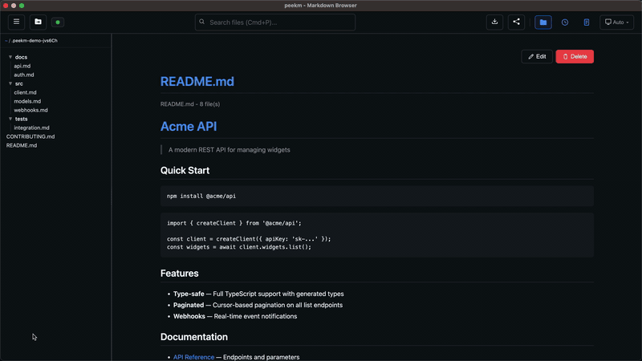

# peekm

[](https://goreportcard.com/report/github.com/razvandimescu/peekm)
[](https://github.com/razvandimescu/peekm/releases)
[](LICENSE)

See what AI coding agents change across all your projects.



AI coding agents modify dozens of files per session — but you only see the final diff. peekm watches all your projects in real time and shows you exactly which files changed, when, and what the agent was doing. It runs as a local web UI backed by a single binary, with a markdown viewer built in for reading docs along the way.

**All data stays local. Nothing leaves your machine.**

```bash
npm i -g @peekm/peekm               # install
peekm .                              # start — Claude Code auto-detected
```

One command. No configuration. AI tracking starts automatically when Claude Code is detected.

Or try without installing: `npx @peekm/peekm .`

## What It Does

**AI session tracking** (works with Claude Code today):
- **Timeline** — chronological view of every AI file modification, grouped by day, color-coded by operation (Edit, Write, NotebookEdit)
- **Smart folders** — "Recent AI Edits" surfaces files touched by AI in the last 24 hours
- **Toast notifications** — appear the instant AI modifies a file, click to navigate
- **Session info panel** — per-file dropdown showing session ID, tool, permission mode, timestamp
- **Transcript viewer** — read the full AI conversation for any session
- **Persistent history** — events survive restarts (`~/.peekm/events.jsonl`)
- **Memory browser** — browse Claude Code's learned project context across all repositories

**Also a markdown viewer:**
- VS Code-style sidebar with tree view and fuzzy search (Cmd/Ctrl+P)
- Live reload via Server-Sent Events with event replay
- Light/Dark/Auto themes, persisted
- In-browser editing with auto-save
- HTML export
- Single binary, cross-platform, < 100ms startup

## Comparison

| | `git diff` | [Git AI](https://usegitai.com) | [Gryph](https://github.com/gryph-sh/gryph) | [claude-code-transcripts](https://github.com/nicobailey/claude-code-transcripts) | peekm |
|---|---|---|---|---|---|
| **Real-time notifications** | — | — | — | — | Toast + live reload |
| **Visual UI** | — | VS Code extension | — | Static HTML | Web UI with tree view |
| **Session correlation** | — | Git notes | — | File-based | Per-file session panel |
| **Persistent history** | Git log | Git notes | Audit log | JSON files | JSONL timeline |
| **Zero config** | Yes | Extension install | CLI setup | Post-hoc script | Yes (auto-detects Claude Code) |
| **Free / OSS** | Yes | Freemium | Free | Free | Free / MIT |

## Installation

**npm** (recommended)
```bash
npm i -g @peekm/peekm
```

Upgrade: `npm update -g @peekm/peekm`

Try without installing: `npx @peekm/peekm .`

**Homebrew**
```bash
brew install razvandimescu/tap/peekm
```

**curl**
```bash
curl -L https://github.com/razvandimescu/peekm/releases/latest/download/peekm_$(uname -s)_$(uname -m).tar.gz | tar xz && sudo mv peekm /usr/local/bin/
```

**Go**
```bash
go install github.com/razvandimescu/peekm@latest
```

[All releases](https://github.com/razvandimescu/peekm/releases) — macOS, Linux, Windows.

## Usage

```bash
peekm README.md         # view a file
peekm .                 # browse a directory
peekm -port 8080 .      # custom port
peekm -browser=false .  # don't open browser
```

| Flag | Default | Description |
|------|---------|-------------|
| `-port` | `6419` | Port to serve on |
| `-browser` | `true` | Auto-open browser |
| `-version` | `false` | Show version |
| `-no-ai-tracking` | `false` | Disable AI tracking |

**Claude Code integration** — peekm automatically configures Claude Code hooks on first run when `~/.claude` is detected. No manual setup needed.

| Subcommand | Description |
|------------|-------------|
| `peekm setup claude-code` | Manually install hooks (auto-setup does this for you) |
| `peekm setup claude-code --port 8080` | Custom port |
| `peekm setup claude-code --remove` | Remove hooks |

Setup is idempotent and non-destructive. Creates `~/.claude/peekm-hook.sh` and adds PostToolUse hooks to `~/.claude/settings.json`.

## Ignoring Directories

peekm excludes `.*`, `node_modules`, `vendor`, `dist`, `venv` by default. Custom exclusions go in `.peekmignore`:

```
target
_site
*.tmp
```

`peekm --show-ignored` to see all active exclusions.

<details>
<summary><strong>How It Works</strong></summary>

1. **Track** — auto-detects Claude Code and installs PostToolUse hooks to correlate AI session metadata with file changes
2. **Watch** — file changes via [fsnotify](https://github.com/fsnotify/fsnotify)
3. **Notify** — SSE with event replay pushes changes to the browser
4. **Parse** — markdown to HTML via [goldmark](https://github.com/yuin/goldmark)
5. **Serve** — local HTTP server with graceful shutdown

</details>

## Development

Go 1.23+. `go build -o peekm && go test -race ./...`

## Contributing

PRs welcome. [Open an issue](https://github.com/razvandimescu/peekm/issues) if something breaks.

## License

MIT — see [LICENSE](LICENSE).

## Acknowledgments

- [goldmark](https://github.com/yuin/goldmark) — Markdown parser
- [fsnotify](https://github.com/fsnotify/fsnotify) — File watching
- [chroma](https://github.com/alecthomas/chroma) — Syntax highlighting

## Related

- [Git AI](https://usegitai.com) — Line-level AI attribution via Git notes
- [Gryph](https://github.com/gryph-sh/gryph) — CLI audit logger for AI agents
- [claude-code-transcripts](https://github.com/nicobailey/claude-code-transcripts) — Post-hoc HTML transcript viewer
- [Vigilo](https://github.com/pchaganti/gx-vigilo) — AI code review guardian
